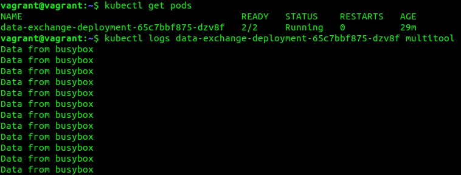

# Домашнее задание к занятию «Хранение в K8s. Часть 1»

### Цель задания

В тестовой среде Kubernetes нужно обеспечить обмен файлами между контейнерам пода и доступ к логам ноды.

------

### Чеклист готовности к домашнему заданию

1. Установленное K8s-решение (например, MicroK8S).
2. Установленный локальный kubectl.
3. Редактор YAML-файлов с подключенным GitHub-репозиторием.

------

### Дополнительные материалы для выполнения задания

1. [Инструкция по установке MicroK8S](https://microk8s.io/docs/getting-started).
2. [Описание Volumes](https://kubernetes.io/docs/concepts/storage/volumes/).
3. [Описание Multitool](https://github.com/wbitt/Network-MultiTool).

------

### Задание 1 

**Что нужно сделать**

Создать Deployment приложения, состоящего из двух контейнеров и обменивающихся данными.

1. Создать Deployment приложения, состоящего из контейнеров busybox и multitool.
2. Сделать так, чтобы busybox писал каждые пять секунд в некий файл в общей директории.
3. Обеспечить возможность чтения файла контейнером multitool.
4. Продемонстрировать, что multitool может читать файл, который периодоически обновляется.
5. Предоставить манифесты Deployment в решении, а также скриншоты или вывод команды из п. 4.

Манифест Deployment - [deployment.yaml](./deployment.yaml)



------

### Задание 2

**Что нужно сделать**

Создать DaemonSet приложения, которое может прочитать логи ноды.

1. Создать DaemonSet приложения, состоящего из multitool.
2. Обеспечить возможность чтения файла `/var/log/syslog` кластера MicroK8S.
3. Продемонстрировать возможность чтения файла изнутри пода.
4. Предоставить манифесты Deployment, а также скриншоты или вывод команды из п. 2.

Манифест DaemonSet - [daemonset.yaml](./daemonset.yaml)

Вывод команды:

```
vagrant@vagrant:~$ kubectl get pods
NAME                         READY   STATUS    RESTARTS   AGE
log-reader-daemonset-khkk8   1/1     Running   0          20m
vagrant@vagrant:~$ kubectl logs log-reader-daemonset-khkk8 | head -n 50
Jan 26 14:59:13 ubuntu-jammy systemd[1]: Mounted Huge Pages File System.
Jan 26 14:59:13 ubuntu-jammy systemd[1]: Mounted POSIX Message Queue File System.
Jan 26 14:59:13 ubuntu-jammy systemd[1]: Mounted Kernel Debug File System.
Jan 26 14:59:13 ubuntu-jammy systemd[1]: Mounted Kernel Trace File System.
Jan 26 14:59:13 ubuntu-jammy systemd[1]: Finished Create List of Static Device Nodes.
Jan 26 14:59:13 ubuntu-jammy systemd[1]: Finished Monitoring of LVM2 mirrors, snapshots etc. using dmeventd or progress polling.
Jan 26 14:59:13 ubuntu-jammy systemd[1]: modprobe@configfs.service: Deactivated successfully.
Jan 26 14:59:13 ubuntu-jammy systemd[1]: Finished Load Kernel Module configfs.
Jan 26 14:59:13 ubuntu-jammy systemd[1]: modprobe@drm.service: Deactivated successfully.
Jan 26 14:59:13 ubuntu-jammy systemd[1]: Finished Load Kernel Module drm.
Jan 26 14:59:13 ubuntu-jammy systemd[1]: modprobe@efi_pstore.service: Deactivated successfully.
Jan 26 14:59:13 ubuntu-jammy systemd[1]: Finished Load Kernel Module efi_pstore.
Jan 26 14:59:13 ubuntu-jammy systemd[1]: modprobe@fuse.service: Deactivated successfully.
Jan 26 14:59:13 ubuntu-jammy systemd[1]: Finished Load Kernel Module fuse.
Jan 26 14:59:13 ubuntu-jammy systemd[1]: Mounting FUSE Control File System...
Jan 26 14:59:13 ubuntu-jammy systemd[1]: Mounting Kernel Configuration File System...
Jan 26 14:59:13 ubuntu-jammy systemd[1]: Started File System Check Daemon to report status.
Jan 26 14:59:13 ubuntu-jammy systemd[1]: Mounted FUSE Control File System.
Jan 26 14:59:13 ubuntu-jammy systemd[1]: Mounted Kernel Configuration File System.
Jan 26 14:59:13 ubuntu-jammy systemd[1]: Finished Load Kernel Modules.
Jan 26 14:59:13 ubuntu-jammy systemd[1]: Starting Apply Kernel Variables...
Jan 26 14:59:13 ubuntu-jammy systemd-fsck[377]: cloudimg-rootfs: clean, 73014/288000 files, 381555/576000 blocks
Jan 26 14:59:13 ubuntu-jammy systemd[1]: Finished File System Check on Root Device.
Jan 26 14:59:13 ubuntu-jammy systemd[1]: Starting Remount Root and Kernel File Systems...
Jan 26 14:59:13 ubuntu-jammy systemd[1]: Finished Set the console keyboard layout.
Jan 26 14:59:13 ubuntu-jammy systemd[1]: Finished Remount Root and Kernel File Systems.
Jan 26 14:59:13 ubuntu-jammy systemd[1]: Starting Device-Mapper Multipath Device Controller...
Jan 26 14:59:13 ubuntu-jammy systemd[1]: Starting Flush Journal to Persistent Storage...
Jan 26 14:59:13 ubuntu-jammy systemd[1]: Condition check resulted in Platform Persistent Storage Archival being skipped.
Jan 26 14:59:13 ubuntu-jammy systemd[1]: Starting Load/Save Random Seed...
Jan 26 14:59:13 ubuntu-jammy systemd[1]: Starting Create System Users...
Jan 26 14:59:13 ubuntu-jammy systemd[1]: Finished Coldplug All udev Devices.
Jan 26 14:59:13 ubuntu-jammy systemd[1]: Finished Apply Kernel Variables.
Jan 26 14:59:13 ubuntu-jammy systemd[1]: Finished Load/Save Random Seed.
Jan 26 14:59:13 ubuntu-jammy systemd[1]: Condition check resulted in First Boot Complete being skipped.
Jan 26 14:59:13 ubuntu-jammy systemd[1]: Finished Flush Journal to Persistent Storage.
Jan 26 14:59:13 ubuntu-jammy systemd[1]: Finished Create System Users.
Jan 26 14:59:13 ubuntu-jammy systemd[1]: Starting Create Static Device Nodes in /dev...
Jan 26 14:59:13 ubuntu-jammy systemd[1]: Finished Create Static Device Nodes in /dev.
Jan 26 14:59:13 ubuntu-jammy kernel: [    0.000000] Linux version 5.15.0-92-generic (buildd@lcy02-amd64-005) (gcc (Ubuntu 11.4.0-1ubuntu1~22.04) 11.4.0, GNU ld (GNU Binutils for Ubuntu) 2.38) #102-Ubuntu SMP Wed Jan 10 09:33:48 UTC 2024 (Ubuntu 5.15.0-92.102-generic 5.15.131)
Jan 26 14:59:13 ubuntu-jammy systemd[1]: Starting Rule-based Manager for Device Events and Files...
Jan 26 14:59:13 ubuntu-jammy kernel: [    0.000000] Command line: BOOT_IMAGE=/boot/vmlinuz-5.15.0-92-generic root=UUID=5c56410c-2039-482b-bc51-f7f2625faf23 ro console=tty1 console=ttyS0
Jan 26 14:59:13 ubuntu-jammy kernel: [    0.000000] KERNEL supported cpus:
Jan 26 14:59:13 ubuntu-jammy kernel: [    0.000000]   Intel GenuineIntel
Jan 26 14:59:13 ubuntu-jammy kernel: [    0.000000]   AMD AuthenticAMD
Jan 26 14:59:13 ubuntu-jammy kernel: [    0.000000]   Hygon HygonGenuine
Jan 26 14:59:13 ubuntu-jammy multipathd[398]: --------start up--------
Jan 26 14:59:13 ubuntu-jammy kernel: [    0.000000]   Centaur CentaurHauls
Jan 26 14:59:13 ubuntu-jammy kernel: [    0.000000]   zhaoxin   Shanghai  
Jan 26 14:59:13 ubuntu-jammy multipathd[398]: read /etc/multipath.conf
```

------

### Правила приёма работы

1. Домашняя работа оформляется в своём Git-репозитории в файле README.md. Выполненное задание пришлите ссылкой на .md-файл в вашем репозитории.
2. Файл README.md должен содержать скриншоты вывода необходимых команд `kubectl`, а также скриншоты результатов.
3. Репозиторий должен содержать тексты манифестов или ссылки на них в файле README.md.

------
